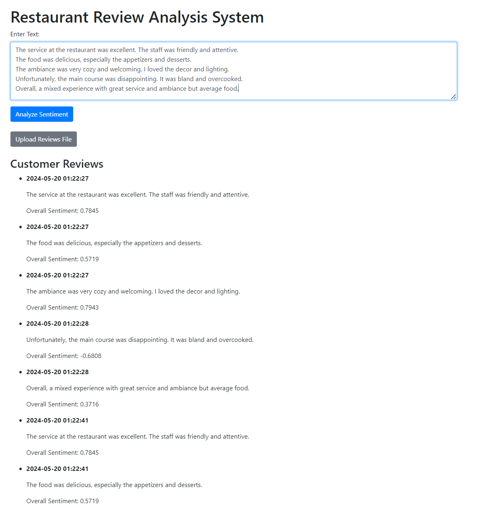

# Restaurant Review System

Restaurant Review System is a Flask-based web application that allows restaurant owners to analyze and visualize customer reviews. This platform leverages natural language processing (NLP) techniques using the [Natural Language Toolkit (NLTK)](https://www.nltk.org/) and [TextBlob](https://textblob.readthedocs.io/en/dev/) in Python.
The system enables users to perform sentiment analysis on individual reviews or upload a text file containing multiple reviews for comprehensive analysis.
The user-friendly interface ensures easy navigation and understanding of the sentiment analysis results, which are presented through interactive visualizations.

The user interface is designed with simplicity in mind, utilizing [Bootstrap CSS](https://getbootstrap.com/) to ensure a clean and responsive design.

Live Demo ---> [Render](https://restaurant-review-analysis-system-xe67.onrender.com)



## Features

- **Sentiment Analysis**: Analyzes the sentiment of individual customer reviews or a batch of reviews from a text file, providing scores for positive, negative, neutral, and compound sentiments using NLTK's VADER and TextBlob.
- **Aspect-Based Sentiment Analysis**: Identifies and analyzes sentiments towards specific aspects of the restaurant experience, such as service, food, and ambiance.
- **File Upload for Batch Analysis**: Allows users to upload a text file containing multiple customer reviews, enabling batch processing and analysis of reviews.
- **Analytics Dashboard**: Provides a visual dashboard to display sentiment trends over time, aspect-based sentiment breakdowns, and other analytical insights using interactive charts.
- **Interactive Visualizations**: Utilizes Chart.js and Plotly to create engaging and interactive charts and graphs that help restaurant owners better understand customer feedback and sentiment trends.

## Directory Structure

```
Restaurant-Review-System/
│
├── app.py                  # Flask application code
├── templates/              # HTML templates
│   ├── index.html          # Main page template
│   ├── upload.html         # Upload page template
│   └── dashboard.html      # Dashboard page template
├── uploads/                # Directory for uploaded files
├── README.md               # Project overview and instructions
└── requirements.txt        # Python dependencies
```

## How to Use

1. **Clone the Repository**:
    ```bash
    git clone https://github.com/Vikranth3140/Restaurant-Review-Analysis-System.git
    cd Restaurant-Review-Analysis-System
    ```

2. **Install Dependencies**:
    ```bash
    pip install -r requirements.txt
    ```

3. **Run the Application**:
    ```bash
    python app.py
    ```

4. **Access the Web Interface**:
    - Open your browser and go to `http://localhost:5000`.
    - Enter a customer review in the provided form and click "Analyze Sentiment" to see the sentiment analysis results.
    - Click on `Upload Reviews File` to upload a text file containing multiple reviews for batch analysis.
    - Navigate to the `Dashboard` to view visualizations and analytical insights of the sentiment analysis results.

## License

This project is licensed under the [MIT License](LICENSE).
